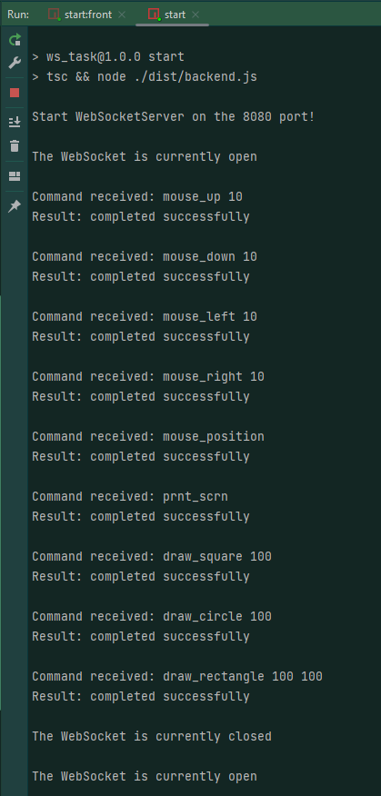

# Websocket Remote Control

## Description
The application consists of a provided user interface and an implemented remote control backend.  
In project we use only:
- jimp,
- robotjs,
- ws, @types/ws,
- nodemon,
- typescript,
- ts-node,
- ts-node-dev,
- eslint and its plugins,
- prettier,
- @types/node

## Installation
1. Open Bash.
2. Change the current working directory to the location where you want the cloned directory.
3. Clone a repo
 `git clone git@github.com:dina-shchobova/remote-control.git`
**or** 
 `git clone https://github.com/dina-shchobova/remote-control.git`

4. Go to development branch `git checkout develop`

5. Install dependencies 
`npm install`

## Usage
 
The application is started by npm scripts:
1. Run **backend** server in **first terminal window** with command:
`npm run start`
2. And  run **frontend** server in **second terminal window** with command:
`npm run start:front`

**Warning:** Refresh browser tab if backend restarted. 

## Implementation details
1. The application works only on  **english** keyboard layout.
2. Browser window have to be in focus when you launch figure-drawing command. 
3. Current mouse position is a center of screenshot.
4. Command and their result being printed in terminal.  

